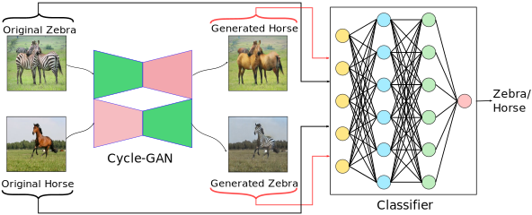

# ImbalanceCycleGAN
This repository contains code for the paper:

### [Mitigating Dataset Imbalance via Joint Generation and Classification](https://arxiv.org/pdf/2008.05524.pdf)

[Aadarsh Sahoo](https://aadsah.github.io/)<sup>1*</sup>, [Ankit Singh](https://griffintaur.github.io/)<sup>2*</sup>, [Rameswar Panda](https://rpand002.github.io/)<sup>3</sup>, [Rogerio Feris](http://rogerioferis.com/)<sup>3</sup>, and [Abir Das](https://cse.iitkgp.ac.in/~adas/)<sup>1</sup> 

<sup>1</sup> IIT Kharagpur, India
<sup>2</sup> IIT Madras, India
<sup>3</sup> MIT-IBM Watson AI Lab, USA


[**ECCV-2020 Workshop on Imbalance Problems in Computer Vision (IPCV).**](https://sites.google.com/view/ipcv2020/)

## Abstract
Supervised deep learning methods are enjoying enormous success in many practical applications of computer vision and have the potential to revolutionize robotics. However, the marked performance degradation to biases and imbalanced data questions the reliability of these methods. In this work we address these questions from the perspective of dataset imbalance resulting out of severe under-representation of annotated training data for certain classes and its effect on both deep classification and generation methods. We introduce a joint dataset repairment strategy by combining a neural network classifier with Generative Adversarial Networks (GAN) that makes up for the deficit of training examples from the under-representated class by producing additional training examples. We show that the combined training helps to improve the robustness of both the classifier and the GAN against severe class imbalance. We show the effectiveness of our proposed approach on three very different datasets with different degrees of imbalance in them. The code is available at https://github.com/AadSah/ImbalanceCycleGAN

&nbsp;
<p align="center">

</p>
<p align="center">
<b>Fig. 1</b>. We propose a joint generation and classification network to tackle severe dataset imbalance in classification scenario. The framework employs a Cycle-consistent GAN to generate new training examples from existing ones and feeds both to the classifier. The GAN and the classifier are trained jointly in an alternating fashion. Our model improves the classification performance especially when the dataset is highly imbalanced and the performance of the GAN is either at par with or experiences minor deterioration compared to the case when the classifier is not trained jointly. </p>
&nbsp;

## Citation
```
@inproceedings{sahoo2020mitigating,
      title={Mitigating Dataset Imbalance via Joint Generation and Classification}, 
      author={Aadarsh Sahoo and Ankit Singh and Rameswar Panda and Rogerio Feris and Abir Das},
      booktitle={ECCV Workshop on Imbalance Problems in Computer Vision},
      year={2020}
}
```
## Contact
aadarsh.sahoo.99@gmail.com

## Acknowledgements
The code was heavily borrowed from [pytorch-CycleGAN-and-pix2pix](https://github.com/junyanz/pytorch-CycleGAN-and-pix2pix).

